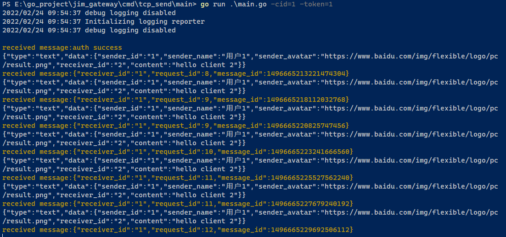
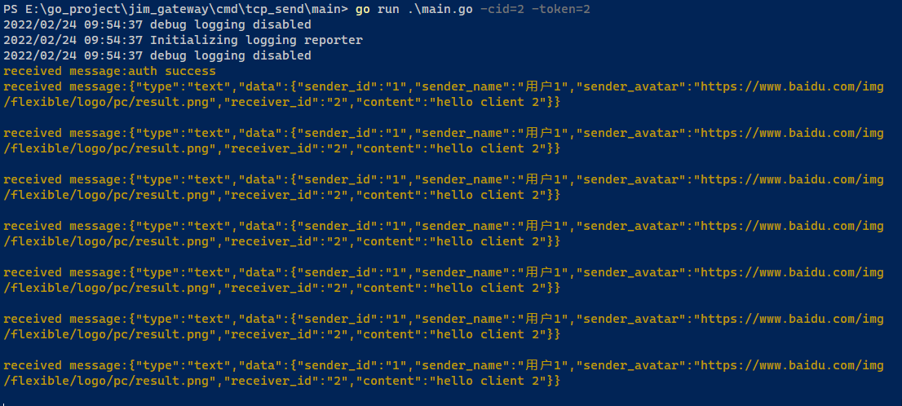

Jim相关文档
===
>说明：写着玩的，里面包含其他代码

### 运行模式
* local
* grpc
* kafka
### 支持连接方式
* websocket
* tcp

### 业务通信协议（采用大端序）
| 字段    | 大小（字节） | 类型 | 备注                  |
|-------|--------|--|---------------------|
| 协议头   | 4      | string | jim1 |
| 命令字   | 4      | string |                     |
| 请求序列号 | 4      | uint32 | 请求序列号               |
| 数据长度  | 4      | uint32 | 数据体长度               |
| 数据体   |        | []byte | 数据体                 |

### 通信协议命令字说明
| 命令字  | 备注          |
|------|-------------|
| A001 | ping        |
| A002 | pong        |
| A999 | close：服务端断开 |
| A998 | close：客户端断开 |
| B001 | 请求认证        |
| B002 | 认证成功        |
| B003 | 认证失败        |
| B101 | C2C单聊消息     |
| B102 | C2G群聊消息     |
| B103 | S2C系统推送消息   |


### 业务消息
* 文本信息：
```json 
{"type":"text","data":{"sender_id":"1","sender_name":"用户1","sender_avatar":"https://www.baidu.com/img/flexible/logo/pc/result.png","receiver_id":"2","content":"hello client 2"}}
```

* 位置信息：
```json 
{"type":"location","data":{"sender_id":"1","sender_name":"用户1","sender_avatar":"https://www.baidu.com/img/flexible/logo/pc/result.png","receiver_id":"2","cover_image":"https://www.baidu.com/img/flexible/logo/pc/result.png","lat":116.5319,"lng":40.016465,"map_link":"https://j.map.baidu.com/8f/Q44c","desc":"深圳湾公园"}}
```

* 表情信息：
```json 
{"type":"face","data":{"sender_id":"1","sender_name":"用户1","sender_avatar":"https://www.baidu.com/img/flexible/logo/pc/result.png","receiver_id":"2","symbol":"[:smile]"}}
```

* 语音信息：
```json 
{"type":"sound","data":{"sender_id":"1","sender_name":"用户1","sender_avatar":"https://www.baidu.com/img/flexible/logo/pc/result.png","receiver_id":"2","url":"https://example.com/a.mp3","size":10240,"seconds":3600}}  
```

* 图片信息：
```json 
{"type":"image","data":{"sender_id":"1","sender_name":"用户1","sender_avatar":"https://www.baidu.com/img/flexible/logo/pc/result.png","receiver_id":"2","format":2,"size ":10240,"width ":500,"height ":700,"icon_url ":"https: //www.baidu.com/img/flexible/logo/pc/result.png","big_url ":"https: //www.baidu.com/img/flexible/logo/pc/result.png"}}
```
>图片格式：format(jpg-0,gif-1,png-2,bmp-3)

* 文件信息：
```json 
{"type":"file","data":{"sender_id":"1","sender_name":"用户1","sender_avatar":"https://www.baidu.com/img/flexible/logo/pc/result.png","receiver_id":"2","size":10240,"name":"a.docx","format":1,"thumb_url":"https://example.com/a.png","url":"https://example/a.docx"}}
```
>文件格式：format(doc-0,docx-1,ppt-2,xls-3)

* 视频信息：
```json 
{"type":"video","data":{"sender_id":"1","sender_name":"用户1","sender_avatar":"https://www.baidu.com/img/flexible/logo/pc/result.png","receiver_id":"2","size":10240,"seconds":3600,"url":"https://example/a.mp4","format":1,"thumb_url":"https://example.com/a.png","thumb_size":1024,"thumb_width":500,"thumb_height":700,"thumb_format":2}}
```
>图片格式：format(jpg-0,gif-1,png-2,bmp-3)  
>视频格式：thumb_format (mp4-0, mov-1, wmv-2, flv-3, avi-4, mkv-5)

* 确认信息：
```json 
{"type":"ack","data":{"receiver_id":"2","request_id":1233,"message_id":89797}}
```
>图片格式：format(jpg-0,gif-1,png-2,bmp-3)  
>视频格式：thumb_format (mp4-0, mov-1, wmv-2, flv-3, avi-4, mkv-5)
> 
### 实际效果
| 说明     | 截图                                          |
|--------|---------------------------------------------|
| 心跳 |     |
| 发送消息 |     |
| 接收消息 |  |