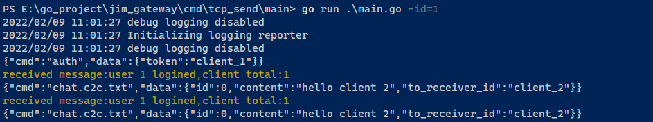
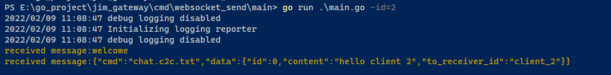

Jim相关文档
===
>说明：写着玩的，里面包含其他代码
###运行模式
* local
* grpc
* kafka
### 支持连接方式
* websocket
* tcp
###消息协议
* 认证消息：
```json 
{"cmd":"auth.req","data":{"token":"client_1"}}
```
* 认证失败：
```json 
{"cmd":"auth.fail","data":{"tip":"auth fail"}}
```
* 未认证：
```json 
{"cmd":"auth.not","data":{"tip":"not auth"}}
```
* Ping：
```json 
{"cmd":"ping","data":{"tip":"ping"}}
```
* Pong：
```json 
{"cmd":"pong","data":{"tip":"ping"}}
```

* 单聊文本信息：
```json 
{"cmd":"chat.c2c.txt","data":{"id":0,"content":"hello client 2","to_receiver_id":"client_2"}}  
```
* 单聊位置信息：
```json 
{"cmd":"chat.c2c.location","data":{"id":0,"cover_image":"https://www.baidu.com/img/flexible/logo/pc/result.png","lat":116.5319,"lng":40.016465,"map_link":"https://j.map.baidu.com/8f/Q44c","desc":"深圳湾公园"}}  
```

* 单聊表情信息：
```json 
{"cmd":"chat.c2c.face","data":{"id":0,"symbol":"[:smile]"}}  
```
* 单聊语音信息：
```json 
{"cmd":"chat.c2c.sound","data":{"id":0,"url":"https://example.com/a.mp3","size":10240,"seconds":3600}}  
```
* 单聊图片信息：
```json 
{"cmd":"chat.c2c.imgae","data":{"id":0,"image_message_item ":[{"format":2,"size ":10240,"width ":500,"height ":700,"url ":"https: //www.baidu.com/img/flexible/logo/pc/result.png"}]}}
```
>图片格式：format(jpg-0,gif-1,png-2,bmp-3)

* 单聊文件信息：
```json 
{"cmd":"chat.c2c.file","data":{"id":0,"size":10240,"name":"a.docx","url":"https://example/a.docx"}}  
```

* 单聊视频信息：
```json 
{"cmd":"chat.c2c.video","data":{"id":0,"size":10240,"seconds":3600,"url":"https://example/a.mp4","format":0,"thumb_url":"https://example.com/a.png","thumb_size":1024,"thumb_width":500,"thumb_height":700,"thumb_format":2}}  
```
>视频格式：format(jpg-0,gif-1,png-2,bmp-3)  
>图片格式：thumb_format (mp4-0, mov-1, wmv-2, flv-3, avi-4, mkv-5)
###实际效果
|说明|截图|
|-----|------|
|单聊发送消息||
|单聊接收消息||